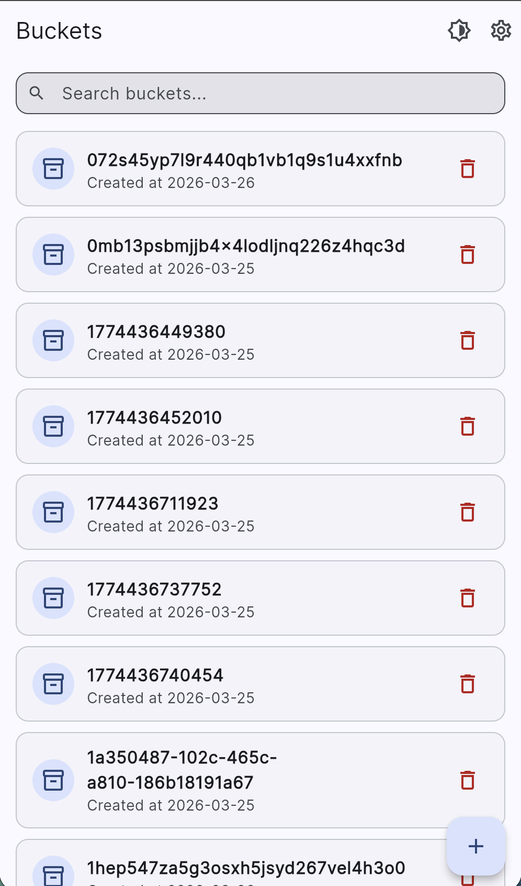
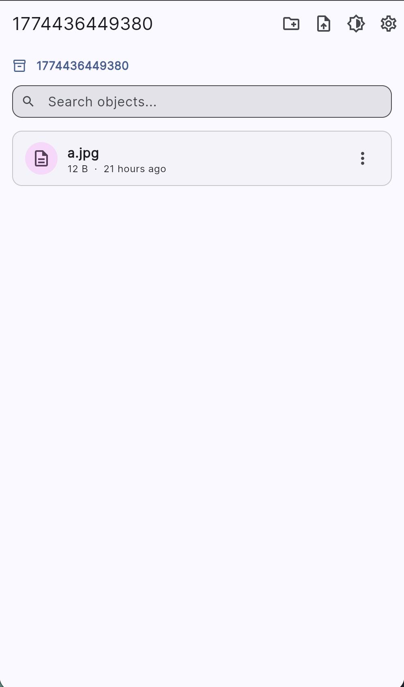
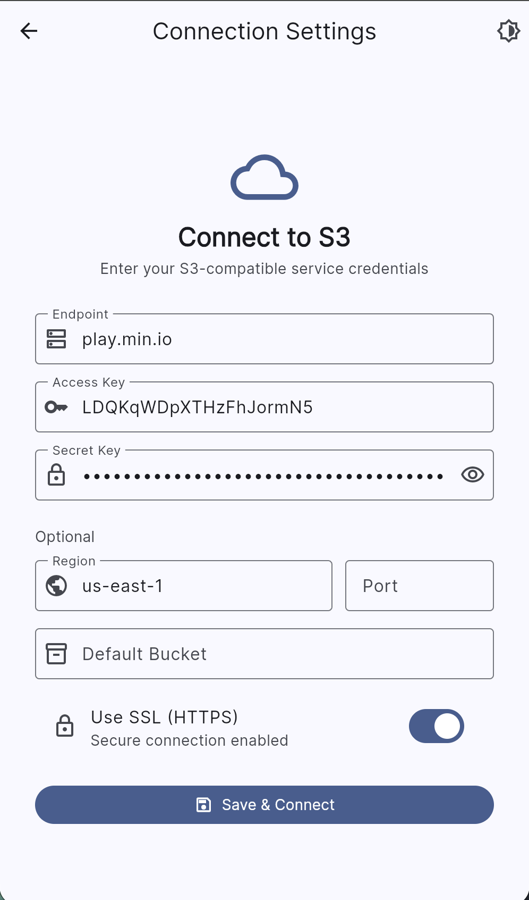

# S3 GUI

A cross-platform S3 client built with Flutter. Browse, upload, and manage files on any S3-compatible storage service — from your desktop, phone, or browser.

## Screenshots

<p align="center">
  
  
  
</p>

## Features

- Connect to any S3-compatible service (AWS S3, MinIO, DigitalOcean Spaces, etc.)
- Browse buckets and navigate directories with breadcrumb navigation
- Upload files via file picker or drag-and-drop
- Download files and copy presigned URLs
- Create and delete buckets, directories, and objects
- Search and filter buckets and objects
- Paginated object listing for large buckets
- Configurable SSL, port, and region
- Secure credential storage
- Light and dark theme
- Runs on Android, iOS, Linux, Windows, macOS, and Web

## Getting Started

### Download

Grab the latest build for your platform from the [Releases](../../releases) page.

### Build from source

```bash
flutter pub get
flutter run
```